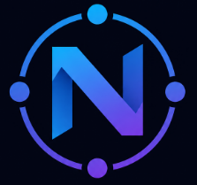

  
    
  
  
  
<strong>Base de Datos Escolar Maestra</strong>

  
Backend centralizado en Supabase con buscador web integrado. 
  Conecta alumnos, personal, cursos, materias, evaluaciones, asistencias e informes en un solo lugar.

---

## Qué es Nexus

Nexus es la capa de datos escolar central del ecosistema. Otros proyectos —como <strong>GIE</strong> (Gestor de Informes Escolares) y desarrollos de equipos externos— consumen y sincronizan sus datos desde esta base de datos maestra, evitando duplicación y garantizando una única fuente de verdad.

El proyecto incluye tanto el <strong>schema PostgreSQL</strong> (tablas, relaciones, RLS e índices) como un <strong>frontend de búsqueda</strong> con diseño propio, filtros por tabla y estadísticas en tiempo real.

---

## Tablas principales

| Entidad | Descripción |
|---------|-------------|
| <strong>Cursos</strong> | Año, división, turno y especialidad |
| <strong>Alumnos</strong> | Datos personales, contacto y vinculación al curso |
| <strong>Personal</strong> | Docentes, preceptores, directivos y administrativos |
| <strong>Materias</strong> | Asignaturas del plan de estudios |
| <strong>Evaluaciones</strong> | Notas por alumno y materia (parciales, finales, TPs, etc.) |
| <strong>Asistencias</strong> | Registro diario de presente, ausente, tarde, justificado |
| <strong>Informes</strong> | Observaciones y seguimientos del personal hacia alumnos |

Las tablas están relacionadas mediante claves foráneas y cuentan con <strong>Row Level Security</strong> para controlar el acceso por rol.

---

## Buscador web

Una interfaz dark-mode inspirada en la identidad visual de Nexus permite explorar los datos sin escribir SQL:

- <strong>Sidebar</strong> con navegación entre tablas y filtros contextuales
- <strong>Búsqueda</strong> por nombre, apellido, DNI, email, rol, especialidad
- <strong>Filtros dinámicos</strong> cargados desde la base de datos (especialidades, divisiones, años, roles, estados)
- <strong>Stats</strong> automáticas al cargar la página
- <strong>Responsive</strong>: sidebar fijo en desktop, drawer en móvil

---

## Conexión con otros proyectos

Nexus no trabaja solo. Proyectos como <strong>GIE</strong> se sincronizan periódicamente para mantener sus alumnos actualizados desde la fuente maestra, mientras conservan sus propias tablas de dominio (informes disciplinarios, usuarios, historial, etc.).

Esto permite que cada equipo evolucione su aplicación sin depender del schema de los demás, pero siempre alineados en los datos base.

---

## Stack

Supabase · PostgreSQL · Vite · JavaScript vanilla · CSS3

---

  Proyecto interno educativo · Nexus Team

