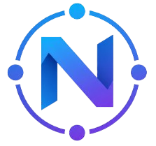

<div align="center">
  
  <br><br>
  
  <p><strong>Base de Datos Escolar Maestra</strong></p>
  <p>Base de datos escolar maestra con backend Spring Boot y buscador web integrado.<br>
  Conecta alumnos, responsables, personal, cursos y materias en un solo lugar.</p>
</div>

---

## Qué es Nexus

Nexus es la capa de datos escolar central del ecosistema. Otros proyectos —como <strong>GIE</strong> (Gestor de Informes Escolares) y desarrollos de equipos externos— se conectan a través del <strong>API Gateway</strong> de Nexus, un sistema de API keys con permisos de solo lectura por tabla que garantiza acceso controlado sin exponer credenciales.

El backend está implementado en <strong>Spring Boot (Java 17 + Gradle)</strong> y se conecta directamente a una base <strong>PostgreSQL local</strong> con JDBC. La autenticación, autorización y el gateway viven en el backend propio; no se depende de servicios externos.

El proyecto incluye tanto el <strong>schema PostgreSQL</strong> (tablas, relaciones, RLS e índices) como un <strong>frontend de búsqueda de solo lectura</strong> con diseño propio, filtros por tabla y estadísticas en tiempo real. No permite crear, editar ni eliminar registros desde la interfaz web.

---

## Tablas principales

| Entidad | Descripción |
|---------|-------------|
| <strong>Cursos</strong> | Año, división, turno y especialidad |
| <strong>Alumnos</strong> | Datos personales, contacto y vinculación al curso |
| <strong>Personal</strong> | Docentes, preceptores, directivos y administrativos |
| <strong>Materias</strong> | Asignaturas del plan de estudios |
| <strong>Responsables</strong> | Padres, madres y tutores de los alumnos |

> Evaluaciones y asistencias están planificadas pero aún no implementadas.

Además, el schema incluye tablas de soporte para la gestión de integraciones:

| Entidad | Descripción |
|---------|-------------|
| <strong>Proyectos</strong> | Sistemas externos autorizados con su API key y permisos JSONB |
| <strong>Sincronizaciones</strong> | Mapeo de IDs locales de Nexus con IDs remotos de otros sistemas |
| <strong>API Logs</strong> | Auditoría automática de cada request al gateway |

Todas las tablas están relacionadas mediante claves foráneas y cuentan con <strong>Row Level Security</strong> para controlar el acceso por rol.

---

## Buscador web

Una interfaz dark-mode inspirada en la identidad visual de Nexus permite explorar los datos sin escribir SQL:

- <strong>Sidebar</strong> con navegación entre tablas y filtros contextuales
- <strong>Búsqueda</strong> por nombre, apellido, DNI, email, especialidad
- <strong>Filtros dinámicos</strong> cargados desde la base de datos (especialidades, divisiones, años, turnos, localidades)
- <strong>Stats</strong> automáticas al cargar la página
- <strong>Responsive</strong>: sidebar fijo en desktop, drawer en móvil

---

## Conexión con otros proyectos

Nexus no trabaja solo. Proyectos como <strong>GIE</strong> (Gestor de Informes Escolares) consumen datos maestros a través del endpoint <code>/api/v1/gateway</code> del backend usando una API key propia, sin acceder directamente a la base de datos.

Cada proyecto externo recibe una <strong>API key independiente</strong> con permisos declarativos por tabla (solo lectura). Esto permite que cada equipo evolucione su aplicación sin depender del schema de los demás, siempre alineados en los datos base, y sin compartir credenciales de la base de datos.

### Cómo integrar un proyecto externo

1. <strong>Entrevista</strong>: el regente de Nexus entrevista al equipo para entender qué datos necesita leer y con qué volumen.
2. <strong>Alta</strong>: se crea el proyecto en la tabla <code>proyectos</code> con una API key y un JSONB de permisos.
3. <strong>Entrega</strong>: el equipo externo recibe la URL del gateway y su <code>x-api-key</code> secreta.
4. <strong>Auditoría</strong>: cada request queda registrado en <code>api_logs</code> para control y diagnóstico.

📖 Ver <a href="docs/api-externos.md">docs/api-externos.md</a> para la documentación técnica completa de integración.  
🎓 Ver <a href="docs/faq-para-companeros.md">docs/faq-para-companeros.md</a> si es la primera vez que conectás un proyecto a una API.

---

## Seguridad y auditoría

- <strong>Acceso cerrado</strong>: el frontend solo está disponible para usuarios autenticados con rol <code>regente</code>.
- <strong>API keys independientes</strong>: cada proyecto externo tiene su propia clave, revocable y roturable.
- <strong>Permisos por tabla</strong>: se define qué tablas puede leer cada proyecto.
- <strong>Restricción por IP</strong>: opcional, se puede limitar el origen de los requests.
- <strong>Rate limiting</strong>: 100 requests por minuto por IP.
- <strong>Auditoría completa</strong>: en <code>api_logs</code> se guardan proyecto, IP, operación, tabla, body, status, error y duración.

---

## Stack

Spring Boot · Java 17 · PostgreSQL (local vía Docker Compose) · JWT · Vite · JavaScript vanilla · CSS3

La base de datos corre **localmente** (PostgreSQL en Docker, o un PostgreSQL instalado en la máquina). El backend funciona con cualquier PostgreSQL compatible; no hay dependencia de servicios externos.

---

## Cómo correr el proyecto

### Desarrollo local

1. Levantar la base de datos (requiere Docker):
   ```bash
   docker compose up -d postgres
   ```
   La primera vez inicializa el schema (`db/schema.sql`): tablas, RLS y el usuario regente por defecto.

2. Instalar dependencias del frontend:
   ```bash
   cd frontend
   npm install
   cp .env.example .env
   # VITE_API_URL=http://localhost:3000/api/v1
   ```

3. Configurar las variables de entorno del backend (ver `backend/.env.example`; los defaults apuntan a la base local):
   - `DB_URL`, `DB_USERNAME`, `DB_PASSWORD`: conexión JDBC (default: `localhost:5432/nexus`, usuario `nexus`)
   - `JWT_SECRET`: clave secreta para firmar tokens (mínimo 32 caracteres)
   - `CORS_ORIGIN`: URL del frontend (`http://localhost:5173`)

4. Levantar el backend (requiere JDK 17):
   ```bash
   cd backend
   ./gradlew bootRun
   ```

5. En otra terminal, levantar el frontend:
   ```bash
   cd frontend
   npm run dev
   ```

### Deploy en el server de la escuela

Este modo usa Docker Compose para levantar PostgreSQL, el backend Spring Boot y el frontend estático con Nginx en un solo servidor.

1. Instalar dependencias y generar el build del frontend:
   ```bash
   cd frontend
   npm install
   cp .env.example .env
   # Ajustar VITE_API_URL=/api/v1 en .env para usar el proxy de Nginx
   npm run build
   ```

2. Configurar variables del backend (Docker Compose las lee del entorno o de un archivo `.env` en la raíz):
   - `JWT_SECRET`: cambiar al menos este valor por uno seguro (mínimo 32 caracteres).

3. Levantar los servicios:
   ```bash
   docker compose up -d --build
   ```

4. Acceder a `http://localhost` (o la IP del servidor) y loguearse con:
   - Usuario: `regente@nexus.local`
   - Contraseña: `Regente123!`

5. Cambiar la contraseña del regente y crear usuarios adicionales directamente en la base (ver `backend/README.md`).

> **Nota:** el schema (`db/schema.sql`) crea roles PostgreSQL (`anon`, `authenticated`, `service_role`) y funciones `auth.role()` / `auth.uid()` para mantener Row Level Security de forma autónoma.

---

<div align="center">
  <sub>Proyecto interno educativo · Hecho con mucho café</sub>
</div>
